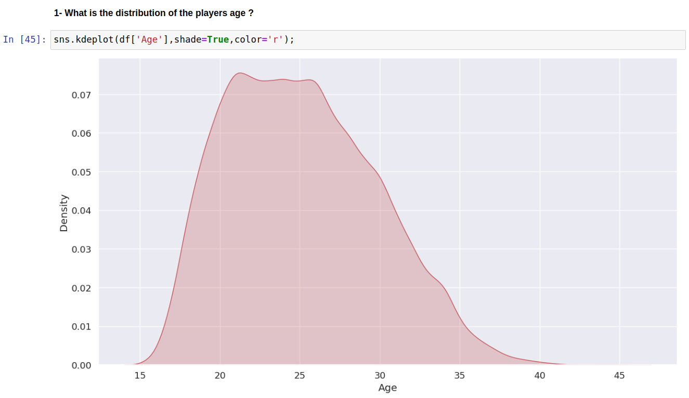
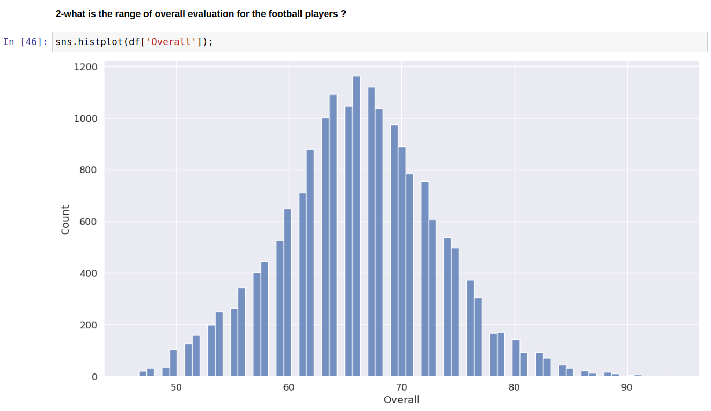
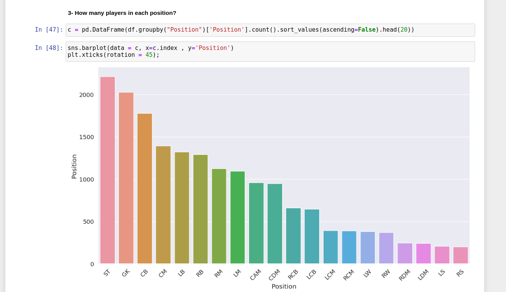
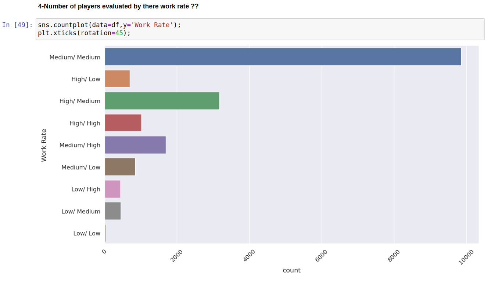
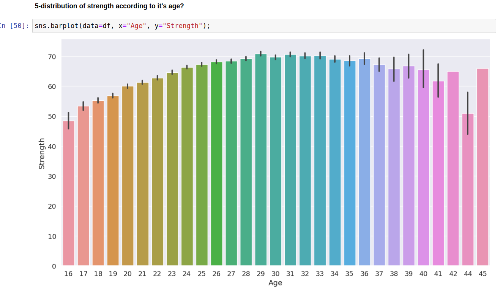
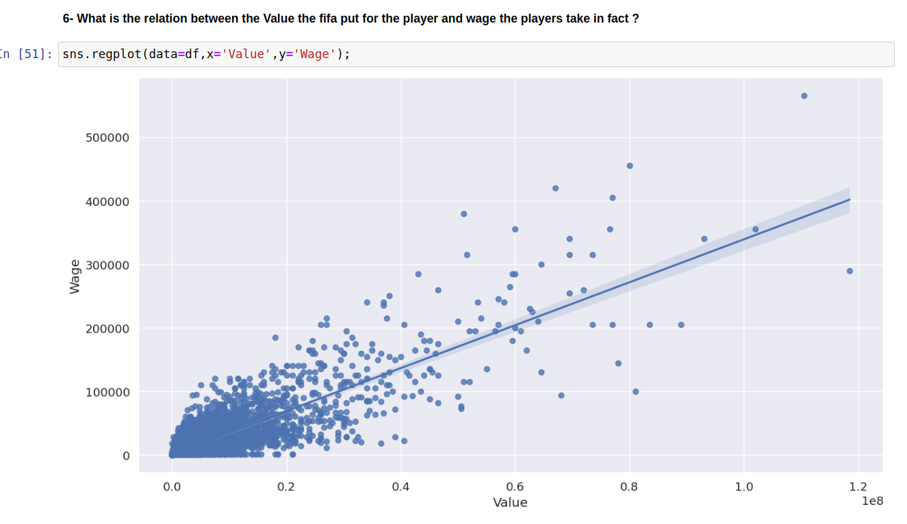
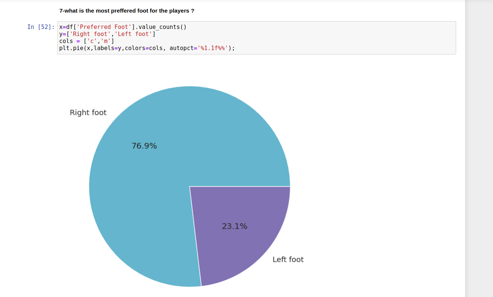
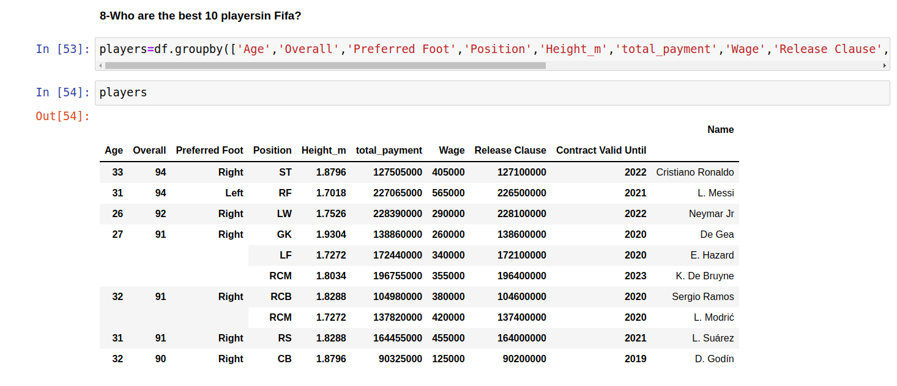
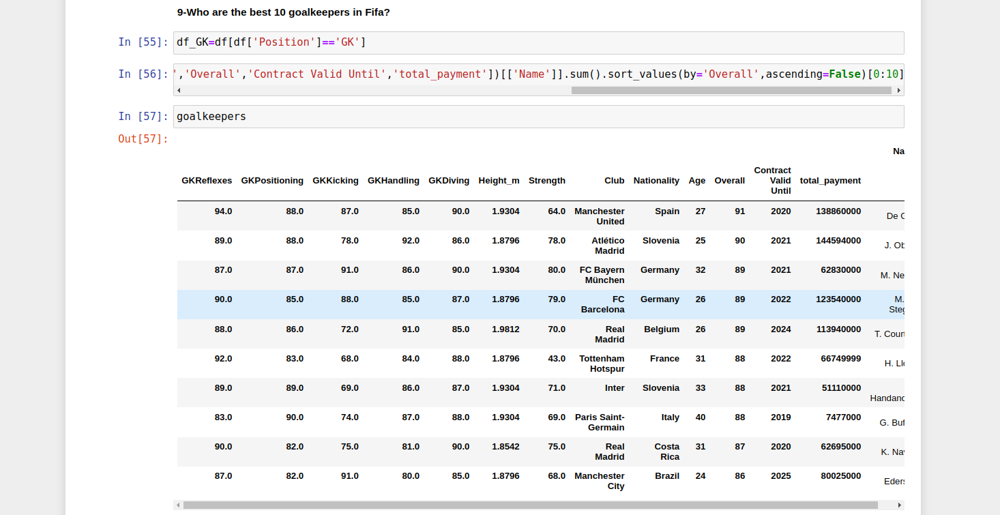

## EDA ON FOOTBALL PLAYERS STATISTICS FROM FIFA ⚽

Who doesn't play fifa all the time? In this project we are analyzing the fifa dataset to understand the distribution of the different players and all the hidden relationships between the fifa statistics. 

# Table of Contents

1. [**IMPORTING LIBRARIES**](#Importing_libraries)

2. [**DATA DESCRIPTION AND DATA CLEANING**](#Data_description_and_data_cleaning)

    1. [Import data](#Import_data)

    2. [Data Exploration](#Data_exploration)

    3. [Data cleaning](#Data_cleaning)

3. [**DATA Visualization**](#Visualization)

    1. [Univariate analysis](#Univariate_analysis)
        - 
        - 
        - 
        - 

    2. [Bivariate analysis](#Bivariate_analysis)
        - 
        - 
        - 

    3. [Descriptive analysis](#Descriptive_analysis)
        - 
        - 

    
4. [**REMOVING UNNECESSARY COLUMNS**](#removing_columns)
